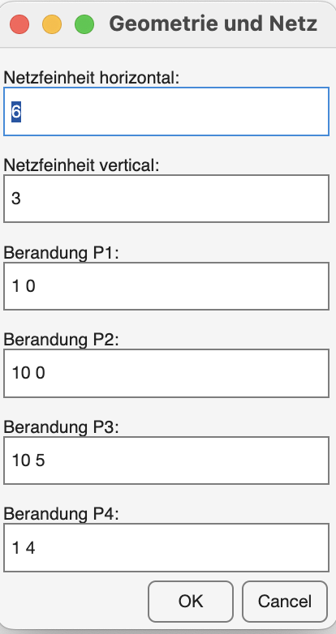
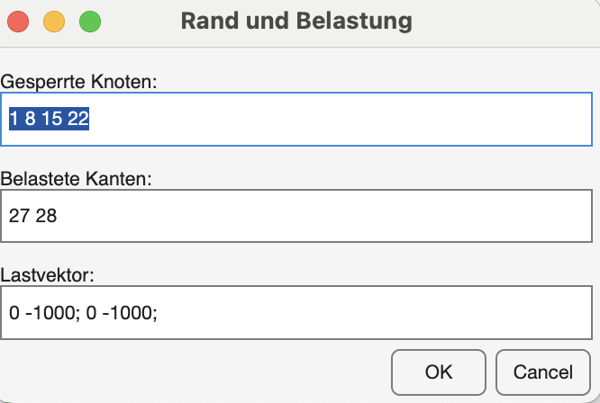
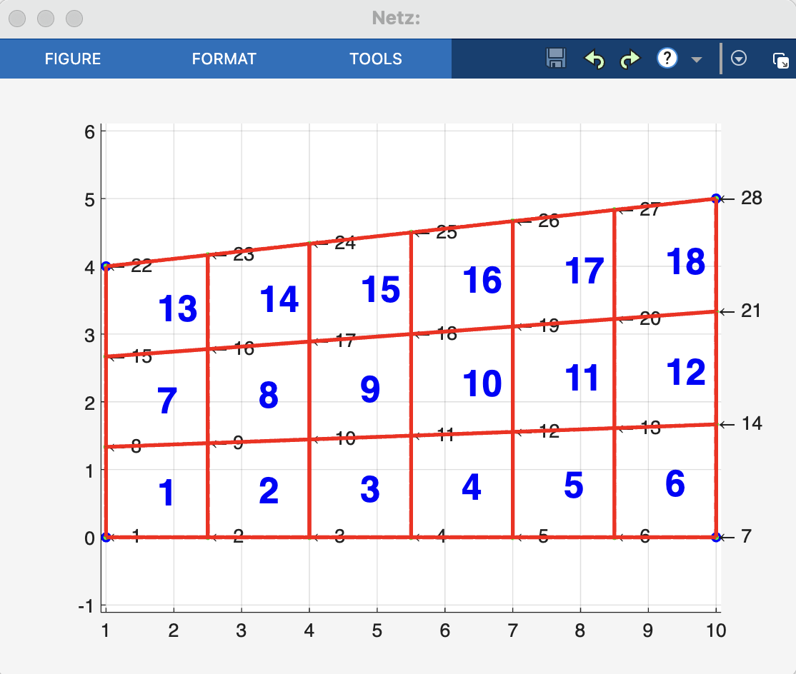
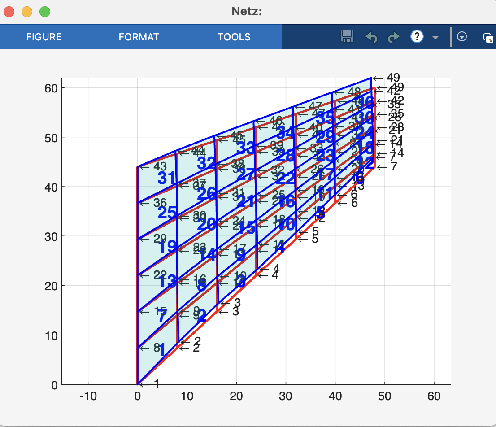

# Matlab® Nonlinear FEM

A geometrically nonlinear Finite Element Method implementation in Matlab.

## Introduction

This project features a basic implementation of a geometrically nonlinear Finite Element Method (FEM) solver using Matlab. 
## Screenshots

## Resources

This implementation is based on the following resources:

- Dipl.-Ing. Dr. Alexander Humer and Dipl.-Ing. Dr. Astrid Pechstein. (2016) *Advanced Computational Methods in Mechanics* Lecture Notes 
- Wriggers, P. (2008). [*Nonlinear Finite Element Methods*](https://books.google.at/books?id=1EWFjTKUELwC). Springer Berlin Heidelberg.

## Further Information

